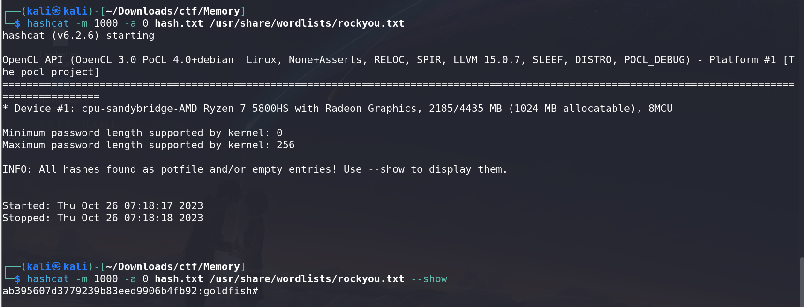
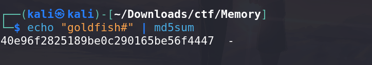

# Bad Memory - CTF Challenge Writeup

## Challenge Information
- **Name**: Bad Memory
- **Points**: 50
- **Category**: Forensics

## Objective
The objective of the "Bad Memory" CTF challenge is to uncover a hidden flag by analyzing the memory dump of a compromised system. This task involves utilizing specific memory analysis tools and techniques to retrieve the flag.

## Solution
Solving the "Bad Memory" challenge involves the use of memory forensics tools, and it's crucial to select the right version of the tool for successful completion.

1. **Choose Volatility 3.0**: This challenge requires the use of volatility 3 instead of volatility 2.6 for unknown reasons. Volatility 2.6 is unable to pick up a profile on the memory file. 


2. **Locate Passwords in Memory**: In memory forensics, passwords can be found in various places. Two common locations are the `LSA Dump` and `Hash Dump`. The `LSA Dump` might reveal passwords in plaintext if they are present, but in this challenge, the password is not stored there.

3. **Explore Hash Dumps**: Focus on the `Hash Dump` section, where passwords are stored as NTLM hashes. Look for the suspicious user's password hash, as this is where the flag is concealed.


4. **Crack the Hash**: Use a tool like Hashcat to crack the NTLM hash and reveal the plaintext password. The command to run Hashcat is:

    ```
    hashcat -m 1000 -a 0 <file containing the hash> <your preferred wordlist>
    ```
    

5. **Convert Password to MD5**: Once you have successfully cracked the password and obtained it in plaintext, convert it into an MD5 hash. This is necessary for submitting it as the flag.


By following these steps and selecting the appropriate version of Volatility, you can successfully retrieve the hidden flag from the memory dump.

## Flag
The flag is in the format `flag{XXXXXXXXXX}`. After cracking the NTLM hash and converting it into MD5, you will be able to submit the flag.