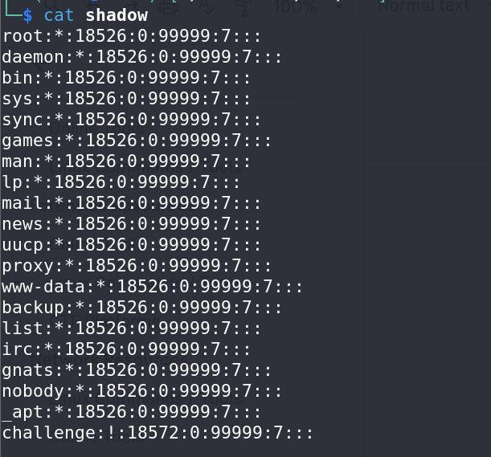
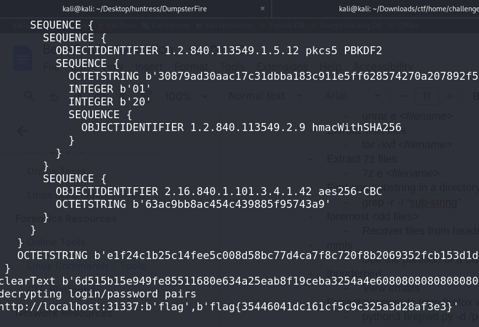

# Dumpster Fire - Forensics Challenge

## Basic Information
**Name:** Dumpster Fire  
**Category:** Forensics  
**Points:** 50

## Objective

The "Dumpster Fire" challenge is a forensics task that involves examining a downloadable file with a familiar Linux directory listing. Your objective is to uncover the hidden flag within this file by exploring its contents and leveraging your knowledge of common Linux directory structures.

## Solution

To successfully complete the "Dumpster Fire" challenge, follow these steps:

1. **Download the File:**
   - Begin by downloading the provided file. Upon inspection, you will find a Linux directory listing, resembling a typical file structure.

2. **Initial Assumption - `/etc/shadow`:**
   - Given the Linux context, you might initially suspect that the flag could be hidden in the `/etc/shadow` file. However, after examining the file, you won't find any clear flags or passwords to decode.

3. **Explore the Linux Directory:**
   - Investigate the contents of the file further by navigating through the directories and exploring various folders. Your goal is to locate the challenge-related folder, which is typically found in the `/home` directory.

4. **Uncover the Mozilla Folder:**
   - While exploring the directories, you might stumble upon a hidden Mozilla folder. This discovery raises suspicion and indicates that Mozilla-related files may be relevant.

5. **Search for Passwords in Mozilla Folder:**
   - In Mozilla, passwords are typically stored in a file named "login.json." Search for this file, and you may find passwords being encrypted in base64-like syntax. But it isnt base64.  

6. **Decrypt Mozilla Passwords:**
   - Upon finding the base64-like-encoded data in "login.json," you'll need to decrypt it. Mozilla uses a key stored in "key4.db" for encryption.

7. **Use `firepwd` Tool for Decryption:**
   - To decrypt Mozilla passwords, use the "firepwd" tool, which can handle the decryption process. You can find the tool here: [firepwd GitHub Repository](https://github.com/lclevy/firepwd).

8. **Execute the `firepwd` Tool:**
   - Run the `firepwd.py` script with the appropriate arguments. Use the `-d` option to specify the directory containing both the "key4.db" and "login.json" files. This will decrypt the Mozilla passwords and reveal the flag.

Flag: flag{XXXXXXXXXX}

**Challenge Solved**  
