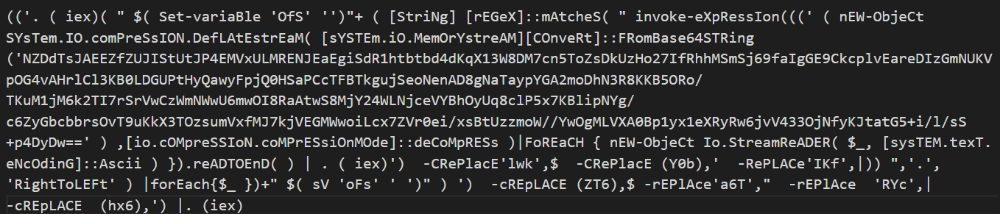
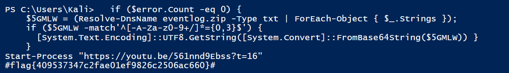

# Texas Chainsaw Massacre: Tokyo Drift - CTF Challenge Writeup

## Challenge Information
- **Name**: Texas Chainsaw Massacre: Tokyo Drift
- **Points**: 50
- **Category**: Forensics

## Objective
The objective of the "Texas Chainsaw Massacre: Tokyo Drift" CTF challenge is to unravel a series of obfuscated scripts hidden within an EVTX file. By following these steps, you can successfully work your way through the layers of obfuscation to extract the hidden flag.

## Solution
In my journey to solve this intriguing challenge, I used a series of forensics techniques and tools to unveil the hidden secrets within the EVTX file.

1. **Open EVTX File with Event Viewer**: The challenge provides an EVTX (Windows Event Log) file. I started by opening the EVTX file using Event Viewer on a Windows machine. This allowed me to access and examine the event logs within the file.

2. **Search for Suspicious Logs**: While navigating through the event logs, I kept an eye out for anything that appeared suspicious and possibly related to the challenge. Eventually, I stumbled upon something that resembled the name of the challenge.

3. **Extract Hexadecimal Data**: Within the suspicious log entry, I located hexadecimal data. I extracted this data with the intention of converting it back into a file for further analysis.

4. **Obtaining Obfuscated Powershell Script**: After successfully converting the hexadecimal data into a file, I discovered a heavily obfuscated Powershell script. The challenge was to deobfuscate this script.

5. **Deobfuscation of Powershell Script**: I embarked on the journey of deobfuscating the Powershell script. As I progressed, I encountered several layers of obfuscation. At one point, I reached an impasse, where further decoding seemed impossible.

6. **Identification of Base64 String**: The Powershell script contained a base64 string that was challenging to decode with conventional tools such as CyberChef. It became apparent that this string underwent additional operations, possibly compression and decompression.

7. **Running the Powershell Code**: With caution, I decided to run the Powershell code to reveal the next layer of obfuscated code. It's essential to be cautious when executing code from unknown sources. I opted to execute the part without "IEX" (Invoke Expression), which is commonly used to run code in Powershell.

8. **Beautify the Code**: The executed code revealed yet another layer of obfuscated code, albeit less obfuscated than the previous layers. I beautified the code to make it more readable.

9.  **Flag Extraction**: By selectively executing the seemingly harmless part of the code, I managed to unveil the hidden flag.

By following these steps, you can successfully work your way through the layers of obfuscation and solve the "Texas Chainsaw Massacre: Tokyo Drift" CTF challenge in the Forensics category.

## Flag
The flag is in the format `flag{XXXXXXXXXX}`. Once you have successfully worked through the layers of obfuscation and executed the relevant parts of the code, you should be able to extract the flag.

**Note**: The actual flag value has been intentionally omitted here, as it is part of the challenge's solution and should be kept secret for a fair competition.
