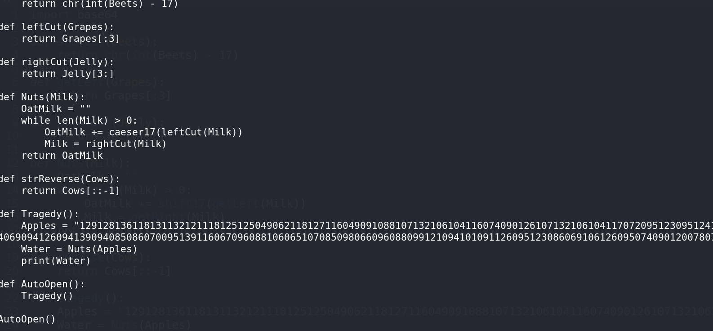

# Tragedy Redux - Forensics Challenge

## Challenge Overview
**Name:** Tragedy Redux  
**Category:** Forensics  
**Points:** 50

## Objective

The objective of the "Tragedy Redux" challenge is to uncover the flag hidden within a Word document. This flag is encoded within the document, and you need to reverse engineer the document's VBA (Visual Basic for Applications) script to decode it.

## Solution Steps

To solve this challenge, follow these steps:

1. **Download the Word Document:**
   - Begin by downloading the provided Word document.

2. **Inspect the Document:**
   - Open the Word document to see what it contains.
   - You'll find that the flag is not readily visible within the document.

3. **Identify VBA Project:**
   - While examining the document, notice that it contains a VBA project.
   - To access the hidden contents, you'll need to analyze the VBA script.

4. **Use oletools' olevba:**
   - To view and analyze the VBA script, use a tool like "olevba" from the oletools suite.
   - This tool is specifically designed to extract and analyze VBA macros from documents.

5. **Reverse Engineer the VBA Script:**
   - Once you've extracted the VBA script, thoroughly examine it.
   - Reverse engineer the code to understand its functionality.

6. **Decode the Flag:**
   - After successfully reverse engineering the code, you will discover a base64 encoded string.
   - Decode this string using a base64 decoder to reveal the flag.

**Challenge Solved**

Flag: flag{XXXXXXXXXX}
