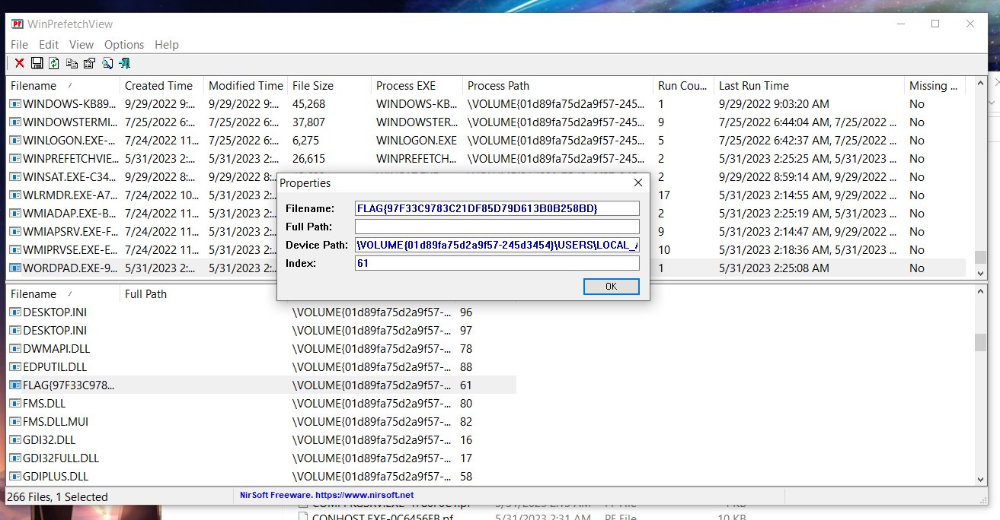

# Wimble - Forensics Challenge

## Basic Information
**Name:** Wimble  
**Category:** Forensics  
**Points:** 50

## Objective

The "Wimble" challenge is a forensics task that involves examining a downloaded file, which is a WIM (Windows Imaging) file. Your objective is to uncover the hidden flag contained within this file.

## Solution

To successfully complete the "Wimble" forensics challenge, follow these steps:

1. **Analyze the Downloaded File:**
   - Begin by examining the downloaded file. You will notice that it is a WIM (Windows Imaging) file, typically used for storing disk images and system backups.

2. **Use a Windows Utility - WinPrefetchView:**
   - To view the content of a WIM file, it's recommended to use a Windows utility called "WinPrefetchView." This utility is designed to analyze and display information from Windows Prefetch files, which are used to speed up the loading of programs.

3. **Extract the Files from the WIM:**
   - To access the files within the WIM file, extract its contents using a tool like 7-Zip (7z). This will decompress and reveal the files and directories within the WIM.

4. **Open WinPrefetchView:**
   - After extraction, open WinPrefetchView on your Windows system. Point the utility towards the directory where you have all the ".pf" (Prefetch) files that were extracted from the WIM file.

5. **Use WinPrefetchView to Analyze Prefetch Files:**
   - With WinPrefetchView, you can analyze and view the information contained in the Prefetch files. These files contain data related to the execution of programs on a Windows system.

6. **Flag Discovery:**
   - While using WinPrefetchView to explore the Prefetch files, you should eventually come across the hidden flag, which is concealed within one of these files.

Flag: flag{XXXXXXXXXX}

**Challenge Solved**  
