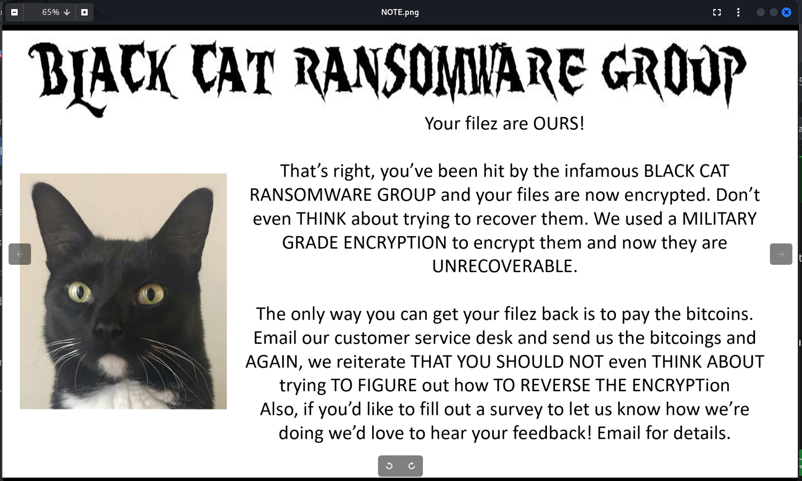
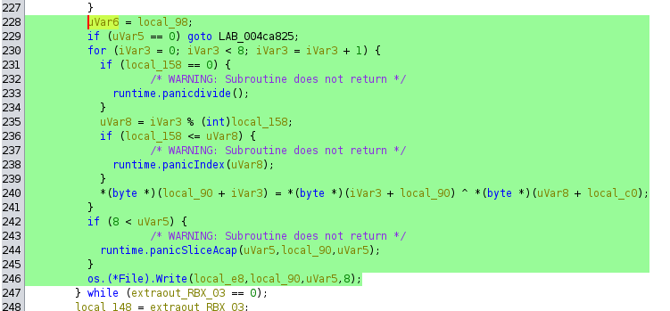
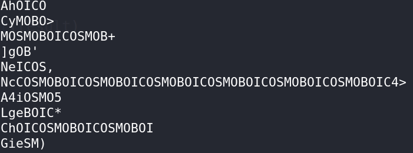
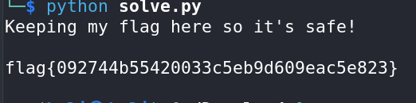

# Blackcat - CTF Challenge Writeup

## Challenge Information
- **Name**: Blackcat
- **Points**: 50
- **Category**: Malware

## Objective
The objective of the "Blackcat" CTF challenge is to decrypt files that have been encrypted using a certain key. The challenge presents an image containing a ransom note, and your task is to decipher the encrypted files by finding the correct decryption key.

## Solution
Solving the "Blackcat" challenge revolves around understanding the encryption technique used and identifying the correct decryption key. Here's a step-by-step guide on how I tackled this task:

1. **Examine the Ransom Note**: To begin, I carefully examined the image containing the ransom note. The note suggested that the goal was to decrypt the files that had been encrypted.


2. **Dynamic Analysis**: For dynamic analysis, I ran the decryption tool provided with the challenge. I observed that the tool could decrypt files using any key with more than 8 characters, regardless of whether it was the correct original key or not. This observation was critical.

3. **Code Analysis**: I delved into the code to understand the encryption process. It was evident that the encryption and decryption involved XOR operations. XOR operations are reversible, provided you have the original key.


4. **Identify the Correct Key**: Now, the challenge was to find the correct key. I tried several combinations, including:
   - Using all the capital letters from the ransom note image.
   - Utilizing capitalized words from the ransom note image.
   - Exploring strings from all the other encrypted files.
   - Attempting to decrypt the encrypted flag with itself.

5. **Discovering the Key - 'cosmoboi'**: After extensive trial and error, I found that the word `cosmoboi` appeared repeatedly within the `entire-text-of-hamlet.txt.encry` file. This discovery led me to believe that `cosmoboi` might be the key.


6. **Python Script to Test the Key**: To confirm whether `cosmoboi` was indeed the key, I created a Python script to decrypt a test file using this key. If the decryption was successful, it would validate the key's correctness.

7. **Success**: The Python script successfully decrypted the test file, confirming that `cosmoboi` was indeed the correct decryption key. 
      ```python
      with open("flag.txt.encry", "rb") as file: 
        content = file.read()

        xor_key = "cosmoboi"

        xor_key = xor_key * (len(content) // len(xor_key)) + xor_key[:len(content) % len(xor_key)]

        result = "".join([chr(content[i] ^ ord(xor_key[i])) for i in range(len(content))])

        print(result)
      ```
      

By following these steps and identifying the correct key, you can decrypt the encrypted files in the "Blackcat" CTF challenge.

## Flag
The flag is in the format `flag{XXXXXXXXXX}`. Once you successfully decrypt the files using the key 'cosmoboi,' you will be able to access and submit the flag.
