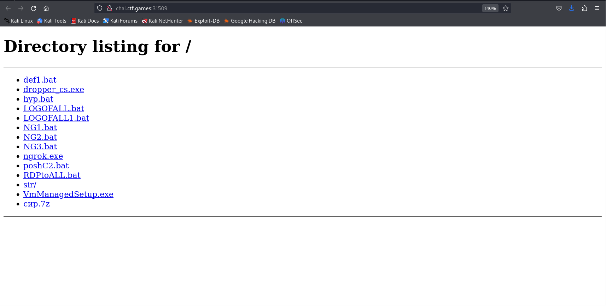
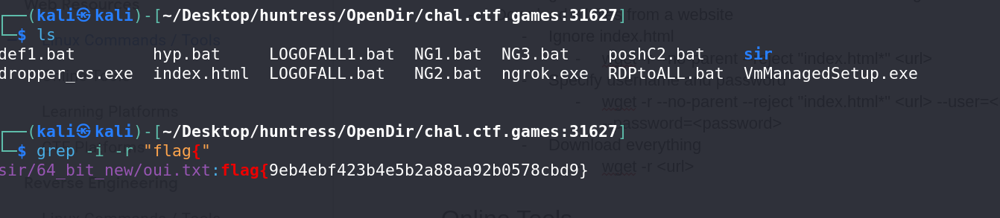

# Opendir - Malware Challenge

## Basic Information
**Name:** Opendir  
**Category:** Malware  
**Points:** 50

## Objective

The "Opendir" challenge falls under the category of malware analysis. Your objective is to find the hidden flag within the files located on a website. The flag is concealed within these files, and your task is to extract it.

## Solution

To successfully complete the "Opendir" malware challenge, follow these steps:

1. **Access the Website:**
   - Start by opening the provided website. Upon access, you will discover a directory containing multiple files.


2. **Download All Files:**
   - Instead of manually browsing through each file within the directory, it's more efficient to download all the files from the website. You can do this using the following command:

      ```
      wget -r <url>
      ```

   - This command recursively downloads all files and directories from the website, preserving the directory structure.

3. **Search for the Flag:**
   - Once you have downloaded all the files, you can use the `grep` command to search for the flag within the files. Execute the following command in the directory where you downloaded the files:
      ```
      grep -r -i "flag{"
      ```
   - This command recursively searches for the flag pattern ("flag{") in all files, including subdirectories.

4. **Flag Discovery:**
   - By executing the `grep` command, you will uncover the hidden flag within one of the files, and it will be displayed as the search result.


Flag: flag{XXXXXXXXXX}

**Challenge Solved**  
