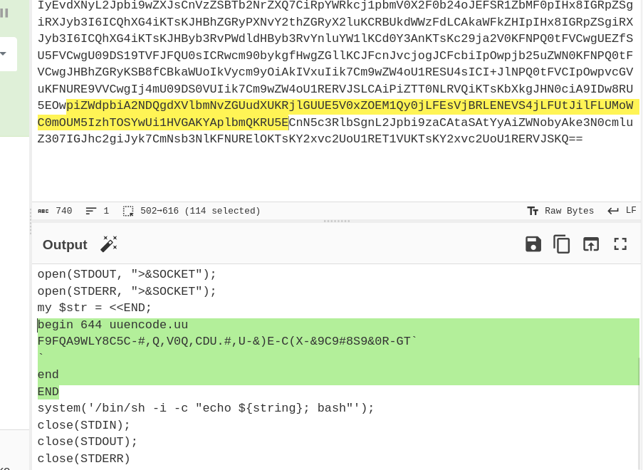

# PHP Stager - CTF Challenge Writeup

Challenge: PHP Stager  
Points: 50  
Category: Malware  

## Objective
The objective of the "PHP Stager" challenge is to deobfuscate a PHP file and uncover the hidden flag within it.

## Solution
To solve the "PHP Stager" challenge, I followed these steps:

1. **Initial File Analysis**:
   - Upon examining the file, it became evident that the PHP code was highly obfuscated. Obfuscation is a technique used to make code more difficult to understand.

2. **Deobfuscation**:
   - To unravel the obfuscation, I started by deobfuscating the code, starting from the end of the file. The goal was to understand the functionality of the code.


3. **XOR Decryption**:
   - I encountered an XOR function within the PHP code. To decode the data, I re-implemented this XOR function in Python. This step required converting the PHP XOR logic to Python, enabling me to decode the obfuscated content.
      ```python
      def deGRi(string, key=''):
          copy_string = string
          result = ''
          i = 0

          while i < len(copy_string):
              j = 0
              while j < len(key) and i < len(copy_string):
                  result += chr(copy_string[i] ^ ord(key[j]))
                  j += 1
                  i += 1

          return result
      ```

4. **Base64 Decoding**:
   - After successfully decoding the XOR-obfuscated data, I discovered a large base64 encoded message. This base64 encoded message was essentially a file.

5. **File Examination**:
   - I extracted and saved the base64-encoded data to a file and proceeded to examine its contents.

6. **Nested Encodings**:
   - Within this file, I uncovered another base64 encoded message. This nesting of encodings continued.


7. **Decode the Flag**:
   - After multiple rounds of decoding, including base64 and uuencode, I successfully revealed the hidden flag.


By deobfuscating the PHP code, implementing the XOR decryption logic in Python, and systematically decoding the nested encodings, I successfully uncovered the flag hidden within the challenge.

## Flag
The flag for this challenge is in the format: `flag{XXXXXXXXXX}`.

In the "PHP Stager" challenge, I had to deobfuscate and decode a PHP file containing various encodings and nesting to reveal the hidden flag.
