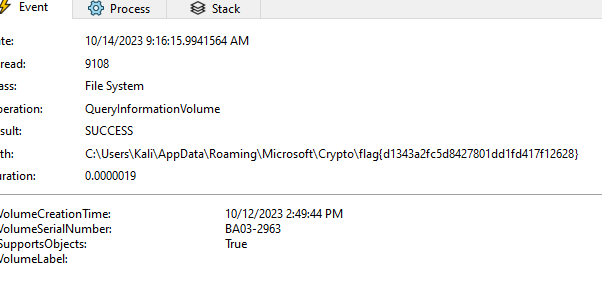

# Snake Eater - Malware Challenge

## Basic Information
**Name:** Snake Eater  
**Category:** Malware  
**Points:** 50

## Objective

The "Snake Eater" challenge is a malware analysis task. Your objective is to understand the behavior of a given Windows executable file and uncover the hidden flag within it.

## Solution

To successfully complete the "Snake Eater" malware challenge, follow these steps:

1. **Use Windows for Analysis:**
   - To effectively analyze this challenge, it's highly recommended to use a Windows operating system. This is because the provided file is a Windows executable and may not run properly on other platforms.

2. **Initial Analysis:**
   - Initially, when I encounter the executable, I have no clear idea about its purpose or functionality.

3. **Reverse Engineering Attempt:**
   - I tried to reverse engineer the program, but I gave up.

4. **Run the Program:**
   - I chose to run the executable program to observe its behavior. During this process, the program will execute and perform various actions on your system.

5. **Use Procmon for Monitoring:**
   - To understand what the program is doing, you can use a tool like Procmon (Process Monitor). Procmon allows you to monitor the system's activities and track the program's actions.

6. **Filter and Search for the Flag:**
   - While using Procmon, you can filter the monitored applications by searching for "Snake Eater." This will help you narrow down the focus to the actions of the specific program.

7. **Flag Discovery:**
   - While monitoring the program's actions in Procmon, you should eventually come across the hidden flag. The flag might be created, accessed, or manipulated by the program during its execution.

Flag: flag{XXXXXXXXXX}

**Challenge Solved**  
