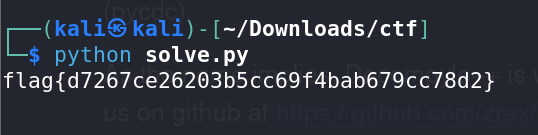

# Snake Oil - CTF Challenge Writeup

## Challenge Information
- **Name**: Snake Oil
- **Points**: 50
- **Category**: Malware

## Objective
The objective of the "Snake Oil" CTF challenge is to analyze and reverse engineer a suspicious executable. This executable appears to have been generated using PyInstaller, a tool that packages Python scripts into standalone executables. The challenge requires you to uncover the hidden flag by deobfuscating the Python code contained within the executable.

## Solution
1. **Examine the Executable**: Begin by loading the provided executable into a disassembler or debugger such as IDA. While examining the code, you will notice several instances of Python code, including references to `__main__` and various Python libraries. These are indications that the executable might have been generated using PyInstaller.

2. **Use PyInstaller Extraction Tool**: PyInstaller generates executables that can be challenging to reverse engineer. To assist in the analysis, a tool called [pyinstxtractor](https://github.com/extremecoders-re/pyinstxtractor) can be used to extract the contents of the PyInstaller executable. This tool will help you retrieve the underlying files.

3. **Observe PYC Files**: After extraction, you will likely encounter multiple PYC (Python Compiled) files. These files contain bytecode and may appear unreadable. To make them human-readable, you'll need to decompile the Python bytecode back into a more understandable format.

4. **Decompile PYC Files**: Utilize a tool like [pycdc](https://github.com/zrax/pycdc) to decompile the PYC files into readable Python source code. This step is crucial for understanding the code's logic and functionality.

5. **Identify Suspicious Code**: By decompiling all the PYC files, you will eventually come across one that appears suspicious or obfuscated. This specific code segment likely holds the key to the challenge.

6. **Deobfuscate Suspicious Code**: Your final challenge is to deobfuscate the suspicious Python code you found. Deobfuscation may involve unraveling code transformations, removing encryption, or uncovering hidden logic. This step may require some manual analysis and coding skills.

By following these steps, you can successfully reverse engineer the "Snake Oil" challenge and discover the hidden flag.

## Flag
The flag is in the format `flag{XXXXXXXXXX}`. Once you have deobfuscated the suspicious Python code within the executable, you should be able to extract the flag.