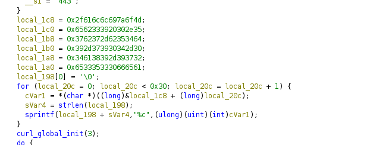
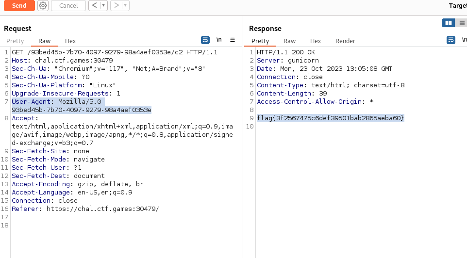

# Speakfriend - CTF Challenge Writeup

## Challenge Information
- **Name**: Speakfriend
- **Points**: 50
- **Category**: Malware

## Objective
The objective of the "Speakfriend" CTF challenge is to uncover the flag hidden within an ELF executable. Below are the steps to solve this challenge.

## Solution
1. **Analyze the ELF Executable**: Begin by examining the provided ELF executable. To analyze the program and understand its behavior, we recommend using a tool like Ghidra, which can disassemble and decompile the binary.

2. **Identify curl_easy_setopt Calls**: During your analysis, you will notice that the program makes multiple calls to `curl_easy_setopt`. This function is commonly used for configuring libcurl options when making HTTP requests.

3. **Examine libcurl Options**: Investigate the specific options being set using `curl_easy_setopt`. In particular, pay attention to the option with the value `0x2722`. This option corresponds to the `user-agent` header option in libcurl.

4. **Investigate SSL-Related Options**: The program also sets several other options related to SSL (Secure Sockets Layer). These options, such as `USE_SSL`, `SSL_VERIFYHOST`, and `SSL_VERIFYPEER`, are commonly used when making secure HTTPS requests.

5. **Decode the Header Value**: The program sets the `user-agent` header based on certain values. Your task is to decode these values to reveal the actual `user-agent` string that is being used. The `user-agent` string is typically used to identify the client making the HTTP request.

6. **Modify the User-Agent Header**: Once you've successfully decoded the `user-agent` string, you should change the `user-agent` header in the web instance provided to you to the decoded string.

## Flag
The flag is in the format `flag{XXXXXXXXXX}`. Once you've successfully modified the user-agent header, you should be able to extract the flag.