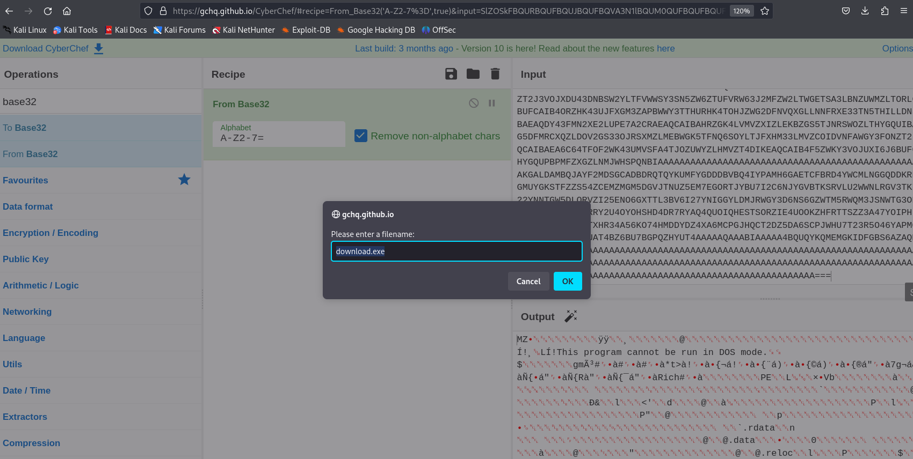
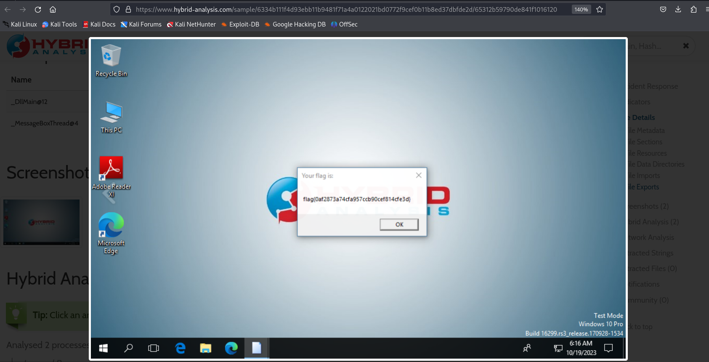

# Thumb Drive - CTF Challenge Writeup

## Challenge Information
- **Name**: Thumb Drive
- **Points**: 50
- **Category**: Malware

## Objective
The objective of the "Thumb Drive" CTF challenge is to uncover a hidden flag by analyzing a series of files and making use of Open Source Intelligence (OSINT). Follow the steps below to successfully solve this challenge.

## Solution
1. **Initiate OSINT**: As with many CTF challenges, your first step should always involve Open Source Intelligence (OSINT). Gather as much information as you can about the provided files and clues.

2. **Examine LNK Files**: Begin by examining the LNK files you are provided with. These files often contain metadata that can lead to valuable clues. You can use the `lnkinfo` tool to extract information from LNK files.

3. **Discover the Partial TinyURL**: While inspecting the LNK files, you will come across a partial TinyURL link. This link will lead you to the next phase of the challenge.

4. **Visit the TinyURL Link**: Access the TinyURL link provided in the LNK files. This will lead you to a file download, which contains a large file.

5. **Decode Base32 Encoding**: The large file from the TinyURL download appears to be encoded using Base32. This encoding is recognized by the presence of only uppercase letters and "==" at the end. Decode the file using a Base32 decoder.

6. **Uncover the Executable File**: Once decoded, you will reveal an executable (exe) file. Note that some antivirus software may flag this file as malware due to its suspicious nature. Proceed with caution and allow it to run in a controlled environment.

7. **Dynamic Analysis and Challenges**: You might attempt to reverse engineer the executable dynamically, but you will discover that it's a DLL (Dynamic Link Library) file and cannot be run independently. I failed to even run it on IDA. 

8. **Leverage Hybrid Analysis**: To solve the challenge, you will need to resort to an external resource. In this case, [Hybrid Analysis](https://www.hybrid-analysis.com/) can be used to analyze and uncover the inner workings of the DLL file.

By following these steps and utilizing resources like Hybrid Analysis, you can successfully navigate through the "Thumb Drive" CTF challenge and extract the hidden flag.

## Flag
The flag is in the format `flag{XXXXXXXXXX}`. Once you have successfully analyzed the DLL file and obtained the hidden information, you should be able to extract the flag.
