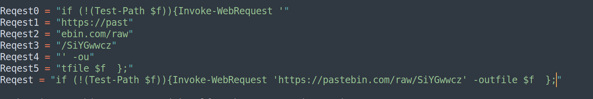

# VeeBeeEee - Malware Challenge

## Basic Information
**Name:** VeeBeeEee  
**Category:** Malware  
**Points:** 50

## Objective

The "VeeBeeEee" challenge is a malware analysis task. Your objective is to decipher and understand the functionality of a given file, which is heavily obfuscated. By analyzing the file, you will discover a link that leads to the hidden flag.

## Solution

To successfully complete the "VeeBeeEee" malware challenge, follow these steps:

1. **Examine the Given File:**
   - Begin by examining the provided file. The hints suggest a connection to `wscript`, which is an environment used to run VBScript (VBS). This indicates that the file might be a encoded VBS script.

2. **Use a VBS Decryptor:**
   - To decrypt the VBS file, you'll need a VBS decryptor. One such online tool is available at [https://master.ayra.ch/vbs/vbs.aspx](https://master.ayra.ch/vbs/vbs.aspx). It's important to note that the website will encrypt or decrypt based on the file format, so ensure the file is in the correct format.

3. **Change File Extension:**
   - Change the extension of the provided challenge file to ".vbe" to match the VBS format. This will allow you to decrypt the file using the online tool.

4. **Decryption:**
   - Once decrypted, you will receive a VBS script. However, it is heavily obfuscated and challenging to read.

5. **Obfuscation Removal:**
   - Start by removing any seemingly extraneous comments from the script. This will make the code easier to read.

6. **Replace & with Spaces:**
   - Notice that the script replaces the character "&" with empty spaces. Mimic this replacement in your version of the script.

7. **Reconstruct Strings:**
   - Reconstruct the strings within the script, as some parts may be obfuscated. As you analyze the script, you should uncover a link.

8. **Access the Link:**
   - Follow the link found within the script. It will lead you to the location of the hidden flag.

Flag: flag{XXXXXXXXXX}

**Challenge Solved**  
