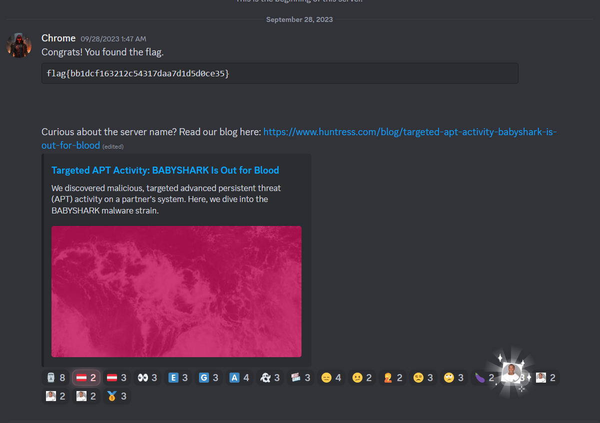

# Discord Snowflake Scramble - CTF Challenge Writeup

## Challenge Information
- **Name**: Discord Snowflake Scramble
- **Points**: 50
- **Category**: Miscellaneous

## Objective
The objective of the "Discord Snowflake Scramble" CTF challenge is to discover and join a Discord server to find the hidden flag. This task may require the use of Discord widgets and HTML to achieve the goal.

## Solution
Solving the "Discord Snowflake Scramble" challenge involves understanding how to join a Discord server using a provided Discord URL. Here's a step-by-step guide on how to accomplish this task:

1. **Analyze the Provided Discord URL**: When presented with the Discord URL, you may initially wonder how to access the server and find the flag. It's not always evident, and this is where your exploration begins.

2. **Explore Discord Documentation**: To better understand how to navigate Discord and access servers, I decided to explore the official Discord documentation. Reading through the documentation can provide valuable insights into Discord's features and functionality.

3. **Attempt to Read Messages Using a Bot**: Initially, I attempted to read messages on the server using a bot. Bots can automate tasks in Discord, and I thought this might be a way to access the flag. However, I encountered challenges in setting up the bot and was unable to proceed with this approach.

4. **Discover Discord Widgets**: After further exploration, I stumbled upon Discord widgets. Discord widgets are a feature that allows you to embed Discord servers into external websites. This presented a potential solution to the challenge.

5. **Create an HTML with the Widget**: To make use of Discord widgets, I started by creating an HTML document with the Discord server's widget. This HTML would serve as a portal to the server.

6. **Customize the Widget ID**: In the HTML document, I modified the widget ID to match the one corresponding to the server I wanted to join. This step is crucial to ensure you access the correct server.
    ```html
    <!DOCTYPE html>
    <html>
    <head>
        <meta charset="UTF-8">
        <title>Solving Discord Snowflake Scramble</title>
    </head>
    <body style="display: flex; justify-content: center; align-items: center; flex-direction: column;">
        <h1>Solving Discord Snowflake Scramble</h1>
        <p>This is a discord widget</p>
        <!-- https://discord.com/channels/1156647699362361364/1156648139516817519/1156648284237074552 -->
        <iframe src="https://discord.com/widget?id=1156647699362361364&theme=dark" width="350" height="500" allowtransparency="true" frameborder="0" sandbox="allow-popups allow-popups-to-escape-sandbox allow-same-origin allow-scripts"></iframe>
    </body>
    </html>
    ```


7. **Load the HTML with the Widget**: After adjusting the widget ID, I loaded the HTML document in a web browser. The widget displayed the Discord server information and included a "Join" button.


8. **Join the Discord Server**: By clicking the "Join" button, I successfully joined the Discord server. This allowed me to access the server's channels and find the flag.


By following these steps and using Discord widgets in an HTML document, you can effectively join the Discord server and retrieve the hidden flag.

## Flag
The flag is in the format `flag{XXXXXXXXXX}`. Once you have successfully joined the Discord server using the provided widget and HTML, you will be able to access the server's channels and find the flag.