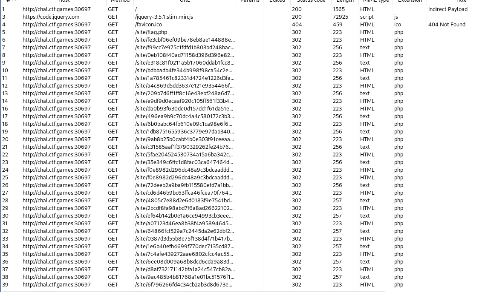

# Indirect Payload - Miscellaneous Challenge

## Challenge Overview
**Name:** Indirect Payload  
**Category:** Miscellaneous  
**Points:** 50

## Objective

The goal of the "Indirect Payload" challenge is to capture and piece together a flag that's distributed across a series of redirects initiated when accessing an instance. The flag is divided into letters and hidden within these redirects.

## Solution Steps

To solve this challenge, follow these steps:

1. **Access the Instance:**
   - Begin by turning on the provided instance.
   - You'll notice that it takes some time to load, which suggests that it's undergoing a series of redirects.

2. **Using Burp Suite:**
   - To capture and analyze the redirects, I used Burp Suite, a web application security testing tool.
   - This tool allows you to intercept and inspect HTTP requests and responses.

3. **Capture and Analyze Redirects:**
   - With Burp Suite in place, access the instance and intercept the series of redirects it generates.
   - You'll observe a substantial number of redirects.

4. **Flag Distribution:**
   - Carefully inspect the content of these redirects.
   - You'll find that the flag is distributed across these redirects, one letter at a time.
   - Each redirect appears to contain a fragment of the flag.

5. **Piece the Flag Together:**
   - To retrieve the complete flag, you'll need to go through each of these redirects, one by one.
   - Extract the flag fragments from each redirect and assemble them to form the complete flag.

**Challenge Solved**

Flag: flag{XXXXXXXXXX}
