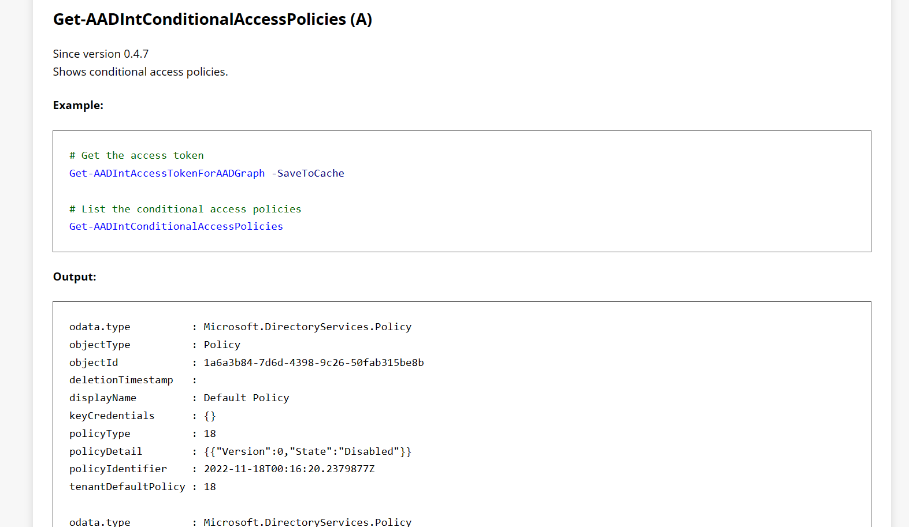
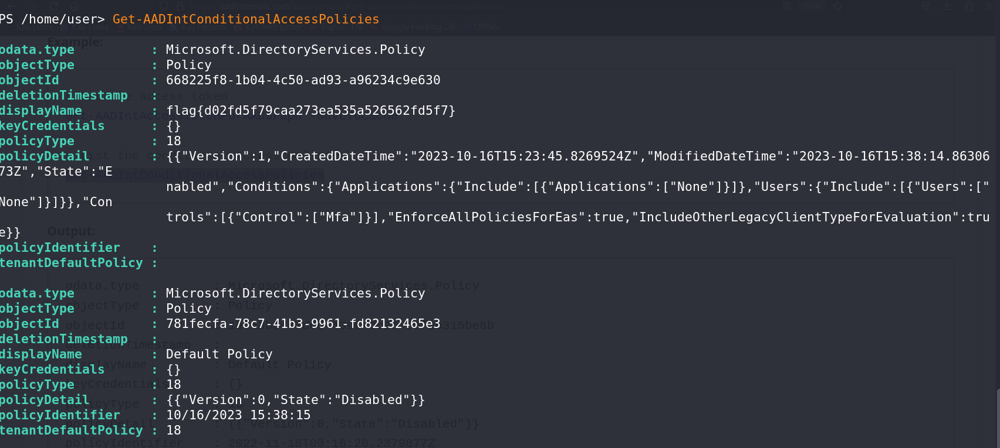

# M Three Six Five - Conditional Access - Miscellaneous Challenge

## Challenge Overview
**Name:** M Three Six Five - Conditional Access  
**Category:** Miscellaneous  
**Points:** 50

## Objective

In the "M Three Six Five - Conditional Access" challenge, participants are provided with an AADInternal Powershell Instance. This instance operates similarly to an SQL database, and certain commands yield specific information. The primary objective is to use the correct command to obtain information related to Conditional Access on the server. Solving this challenge requires participants to identify and execute the appropriate command.

## Solution Steps

To successfully complete this challenge, follow these steps:

1. **Examine the AADInternal Powershell Instance:**
   - Begin by exploring the AADInternal Powershell Instance provided in the challenge. Gain an understanding of how it operates and the type of data it can provide.

2. **Learn the Available Commands:**
   - The Powershell instance functions like a database, and different commands will provide various types of information.
   - Familiarize yourself with the available commands and their respective purposes.

3. **Identify the Required Command:**
   - To solve this challenge, you need to find the specific command that retrieves information about Conditional Access on the server.
   - The command you're looking for is "Get-AADIntConditionalAccessPolicies."
   - Execute this command to obtain the necessary information.

**Challenge Completed**

Flag: flag{XXXXXXXXXX}

This writeup presents a solution for the "M Three Six Five - Conditional Access" challenge. Participants must use the AADInternal Powershell Instance effectively to identify and execute the "Get-AADIntConditionalAccessPolicies" command, which retrieves information regarding Conditional Access on the server, leading to the flag.
