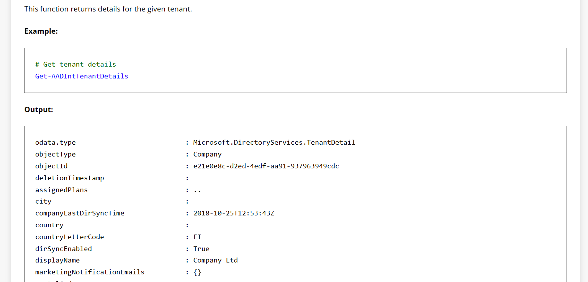
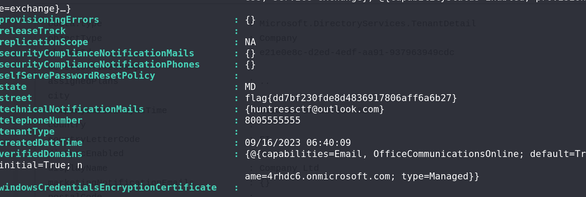

# M Three Six Five - General Info - Miscellaneous Challenge

## Challenge Overview
**Name:** M Three Six Five - General Info  
**Category:** Miscellaneous  
**Points:** 50

## Objective

In the "M Three Six Five - General Info" challenge, participants are provided with an AADInternal Powershell Instance. The objective is to understand how this Powershell instance works and utilize specific commands to retrieve valuable information. To solve the challenge, participants need to know the command that can be used to gather essential data.

## Solution Steps

To solve this challenge, follow these steps:

1. **Analyze the Provided Powershell Instance:**
   - Begin by exploring the AADInternal Powershell Instance given in the challenge. Take note of its functionality and behavior.

2. **Understand the Commands:**
   - The Powershell instance operates similarly to a database, where specific commands yield particular information.
   - Gain an understanding of the available commands and their functions to interact effectively with the instance.

3. **Identify the Crucial Command:**
   - The key to solving the challenge is discovering the correct command to extract essential data from the instance.
   - The specific command required for this challenge is "Get-AADIntTenantDetails."
   - Execute this command to obtain the necessary information.

**Challenge Solved**

Flag: flag{XXXXXXXXXX}

This writeup provides a solution for the "M Three Six Five - General Info" challenge. Participants must navigate the AADInternal Powershell Instance and correctly identify the command "Get-AADIntTenantDetails" to retrieve valuable information, ultimately leading to the flag.
