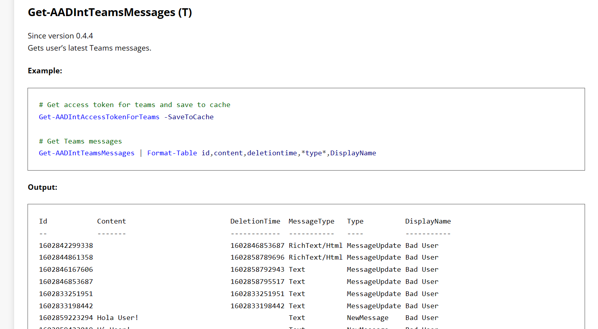
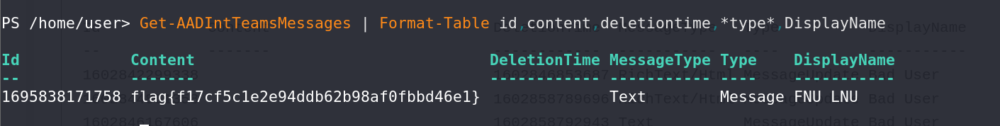

# M Three Six Five - Teams - Miscellaneous Challenge

## Challenge Overview
**Name:** M Three Six Five - Teams  
**Category:** Miscellaneous  
**Points:** 50

## Objective

In the "M Three Six Five - Teams" challenge, participants are tasked with obtaining a flag by leveraging the Microsoft Teams feature within an AADInternal Powershell Instance. This instance simulates a database, and specific commands can be used to extract valuable information. The goal is to find the flag by executing the correct command.

## Solution Steps

To successfully complete this challenge, follow these steps:

1. **Access the AADInternal Powershell Instance:**
   - Begin by accessing the AADInternal Powershell Instance, which functions similarly to a database and offers specific data retrieval commands.

2. **Learn About Available Commands:**
   - Familiarize yourself with the available commands within the Powershell instance and understand their purposes.

3. **Execute the Appropriate Command:**
   - The key to solving this challenge is to use the command that retrieves information related to Microsoft Teams messages.
   - To find the flag, execute the command `Get-AADIntTeamsMessages | Format-Table id, content, deletiontime, *type*, DisplayName`.

**Challenge Completed**

Flag: flag{XXXXXXXXXX}

This writeup provides a solution for the "M Three Six Five - Teams" challenge. Participants must utilize the AADInternal Powershell Instance to run the command "Get-AADIntTeamsMessages | Format-Table id, content, deletiontime, *type*, DisplayName" in order to retrieve information about Microsoft Teams messages, ultimately leading to the discovery of the flag.
