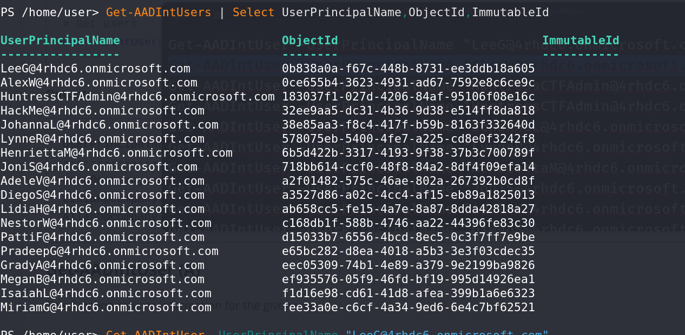
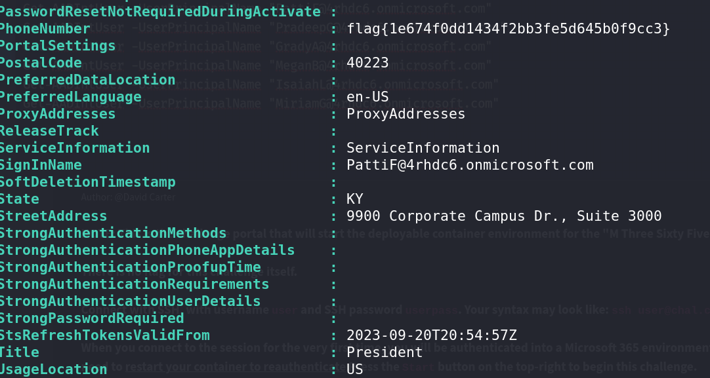

# M Three Six Five - The President - Miscellaneous Challenge

## Challenge Overview
**Name:** M Three Six Five - The President  
**Category:** Miscellaneous  
**Points:** 50

## Objective

In the "M Three Six Five - The President" challenge, participants are tasked with finding specific users and gathering information about them using the AADInternal Powershell Instance. This instance simulates a database, and participants must run commands to retrieve user data and ultimately locate the flag.

## Solution Steps

To successfully complete this challenge, follow these steps:

1. **Access the AADInternal Powershell Instance:**
   - Begin by accessing the AADInternal Powershell Instance, which functions similarly to a database, and offers specific data retrieval commands.

2. **Retrieve User Data:**
   - Execute the command `Get-AADIntUsers | Select UserPrincipalName, ObjectId, ImmutableId` to obtain information about users. This command will provide a list of user principal names, object IDs, and immutable IDs.

3. **Locate the Flag:**
   - To find the flag, you need to identify specific users who may be related to the challenge.
   - Run the command `Get-AADIntUser -UserPrincipalName "LeeG@company.com` to obtain information about an individual user with the provided user principal name.
   - Go through all the users one by one, checking their details until you eventually locate the flag.

**Challenge Completed**

Flag: flag{XXXXXXXXXX}

This writeup provides a solution for the "M Three Six Five - The President" challenge. Participants must utilize the AADInternal Powershell Instance to run the commands "Get-AADIntUsers" and "Get-AADIntUser" to retrieve user data and identify the user associated with the flag. By following these steps, participants can successfully complete the challenge.
