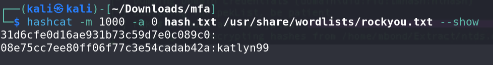
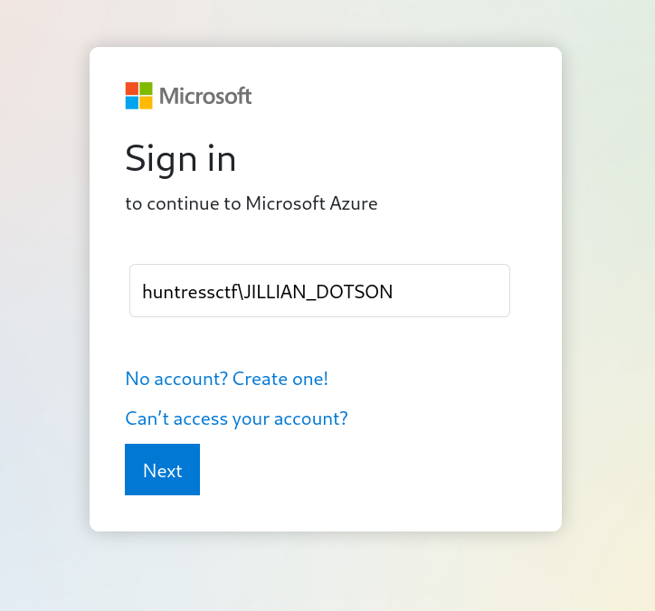
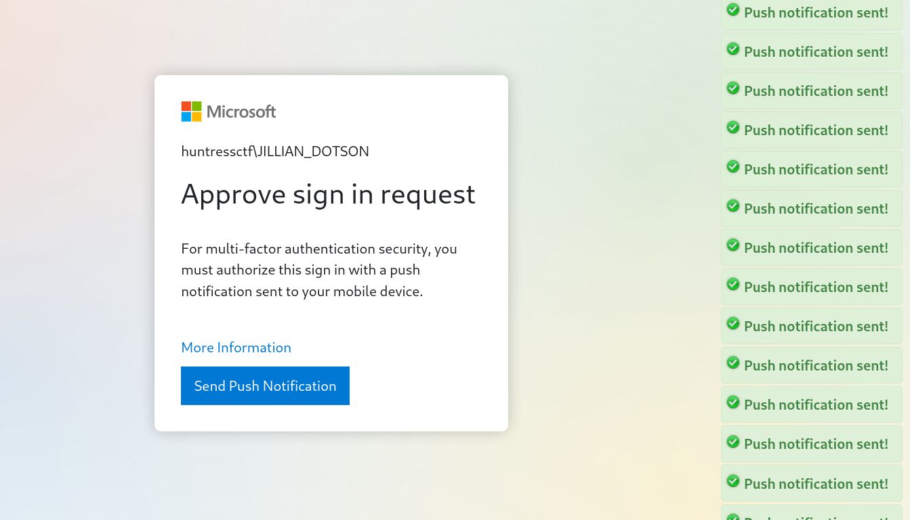
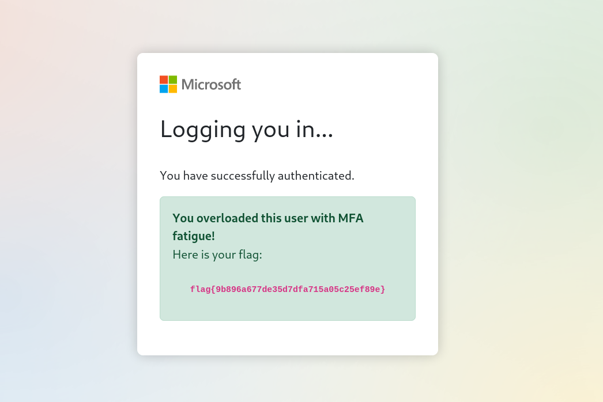

# MFAtigue - CTF Challenge Writeup

## Challenge Information
- **Name**: MFAtigue
- **Points**: 50
- **Category**: Miscellaneous

## Objective
The objective of the "MFAtigue" CTF challenge is to navigate the complexities of multi-factor authentication (MFA) and discover a way to access a protected web instance. This challenge involves extracting and cracking passwords from a specific file and applying clever strategies to overcome MFA hurdles.

## Solution
Solving the "MFAtigue" challenge requires a combination of password extraction, cracking, and strategic MFA manipulation. Here's a step-by-step guide on how to accomplish this task:

1. **Understand the NTDS.dit and SYSTEM Files**: Initially, I was presented with an NTDS.dit file and a SYSTEM file. To make progress, I needed to understand the significance of these files.
   1. *NTDS.dit*: The NTDS.dit file is a critical component of Windows Active Directory, containing user and domain information.

2. **Extract Passwords with Impacket's secretsdump.py**: I realized that the NTDS.dit file might contain valuable user passwords. To extract these passwords, I employed Impacket's `secretsdump.py` tool. The command to extract passwords from the NTDS.dit and SYSTEM files is as follows:
   1. ```python secretsdump.py -ntds <ntds.dit file> -system <system file> LOCAL```

3. **Crack User Passwords with Hashcat**: After extracting passwords, I was left with a collection of username and password pairs. To make sense of this data, I employed Hashcat to attempt to crack the passwords. Unfortunately, Hashcat successfully cracked only two passwords: one belonging to the "guest" account and the other to "JILLIAN_DOTSON."



1. **Log in with JILLIAN_DOTSON's Credentials**: I attempted to log in to the web instance using the credentials of "JILLIAN_DOTSON." However, I soon realized that I needed to deal with MFA to access the account.


1. **Explore the Guest Login**: When attempting to access the account as a guest, I encountered a login failure.

2. **Recall MFA Attack Strategies**: I recalled a recent Microsoft MFA breach where attackers inundated users with an excessive number of MFA requests until they relented and granted access. The challenge's title, "FAtigue", hinted at this strategy.
   1. [Microsoft MFA Breach](https://terralogic.com/mfa-bypass-techniques-a-threat-analysis-from-microsoft/)

3. **Spam the MFA Button**: I decided to apply the MFA attack strategy by spamming the MFA button. Despite the initial login failures, persistence eventually led to a breakthrough, and I successfully bypassed the MFA barriers.



By following these steps and creatively manipulating MFA, I overcame the challenge and accessed the protected web instance.

## Flag
The flag is in the format `flag{XXXXXXXXXX}`. After successfully navigating password extraction, cracking, and MFA manipulation, you will be able to find and submit the flag.