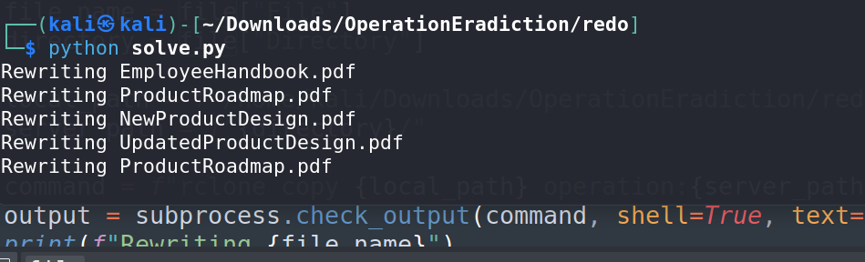
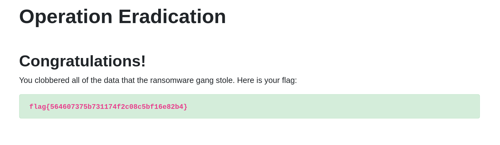

# Operation Eradication - CTF Challenge Writeup

## Challenge Information
- **Name**: Operation Eradication
- **Points**: 50
- **Category**: Miscellaneous

## Objective
The objective of the "Operation Eradication" CTF challenge is to regain control of a server whose configuration file is provided. The server is compromised, and your mission is to eradicate the attacker's access by overwriting all files on the server with empty copies. Follow these steps to achieve this.

## Solution
1. **Analyze the Provided Configuration File**: You are informed that the given file is a configuration file for a server. Upon examination, you will discover that this is a configuration file for a tool called "rclone."

2. **Understanding Rclone**: [Rclone](https://rclone.org/) is a command-line program used to manage files on cloud storage. It supports a wide range of cloud storage providers and is commonly used for data synchronization.

3. **Decrypt the Encrypted Password**: To set up the server with this configuration, you will need to decrypt the password stored in the rclone configuration file. Rclone encrypts this password for security reasons. You can use a tool called [rclonedeobscure](https://github.com/maaaaz/rclonedeobscure) to decrypt the password. Run this tool on the encrypted password to obtain the plaintext password.


4. **Configure Rclone**: Proceed to set up your rclone configuration by running the `rclone config` command with the decrypted password. This will allow you to access and manage files on the server.

5. **Eradicate the Attacker's Files**: The challenge revolves around eradicating the attacker's access to the server. Initially, you may consider deleting files on the server, but you will likely encounter permission issues as you don't have sufficient access rights.

6. **Overwrite Files**: Since you only have permission to download and upload files, your only option is to replace and overwrite the files on the server with empty ones. Essentially, you need to rewrite the files to make them empty.
```python
#Creating Empty Files
def createFiles():
	for file in files:
		file = file["File"]

		with open(f"allFiles/{file}", "w") as create_file: 
			pass
```

7. **Identify and Create Empty Files**: Start by identifying all the 130+ files on the server using the `rclone ls <your config>` command. Then, create empty local copies of these files on your machine.

8. **Upload Empty Files**: Use a script or batch process to upload the empty files onto the server, overwriting the existing files. Make sure each empty file is uploaded to its respective directory to maintain the server's structure.





By following these steps, you will successfully complete the "Operation Eradication" challenge and regain control of the server.

## Flag
The flag is in the format `flag{XXXXXXXXXX}`. Once you have successfully overwritten all the files on the server with empty copies, you should be able to extract the flag.

**Note**: The actual flag value has been intentionally omitted here, as it is part of the challenge's solution and should be kept secret for a fair competition.
