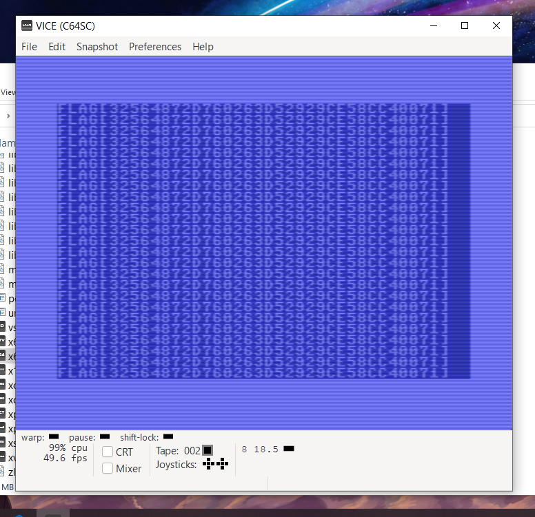

# PRESS PLAY ON TAPE - Miscellaneous Challenge

## Challenge Overview
**Name:** PRESS PLAY ON TAPE  
**Category:** Miscellaneous  
**Points:** 50

## Objective

In the "PRESS PLAY ON TAPE" challenge, participants are provided with a Commodore 64 (C64) wav file. The objective is to play this C64 program using a C64 emulator and extract the flag. To accomplish this, participants need to set up a Windows Virtual Machine (VM) and use specific tools, including VICE and a WAV to TAP conversion tool.

## Solution Steps

To successfully complete this challenge, follow these steps:

1. **Set Up a Windows VM:**
   - Start by configuring a Windows Virtual Machine (VM) on your system, as the required tools are specific to the Windows environment.

2. **Use VICE Emulator:**
   - Install and configure VICE, a Commodore 64 emulator, on your Windows VM. VICE will allow you to load and execute C64 programs.

3. **Convert WAV to TAP:**
   - Obtain a tool for converting the provided WAV file into a TAP file, which is compatible with the VICE emulator.

4. **Load the C64 Program:**
   - Launch the VICE emulator and load the converted TAP file into the emulator.

5. **Run the Program:**
   - Execute the C64 program within the emulator and observe its output.

6. **Extract the Flag:**
   - By running the program in the VICE emulator, you can access the flag embedded within the C64 program.

**Challenge Completed**

Flag: flag{XXXXXXXXXX}

This writeup outlines the solution for the "PRESS PLAY ON TAPE" challenge. By setting up a Windows VM, configuring the VICE emulator, and converting the provided WAV file to a TAP file, participants can load and execute the C64 program to uncover the flag.
