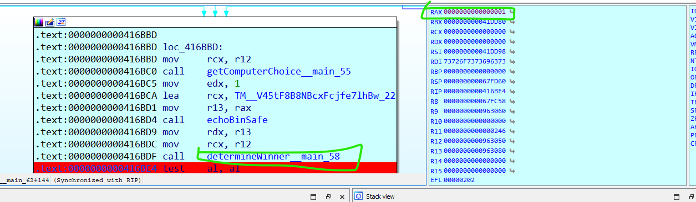
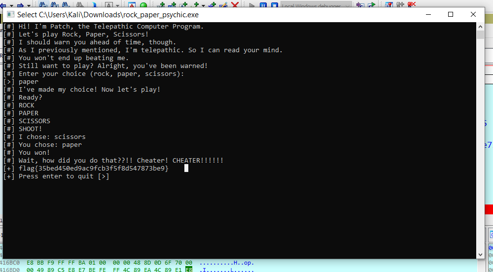

# Rock Paper Psychic - Miscellaneous Challenge

## Challenge Overview
**Name:** Rock Paper Psychic  
**Category:** Miscellaneous  
**Points:** 50

## Objective

In the "Rock Paper Psychic" challenge, participants are presented with a Microsoft executable file. The objective is to determine the winning outcome of a game, and to do so, participants need to use IDA (Interactive Disassembler) to reverse engineer the program and identify key functions. By altering specific values at a critical point in the program, participants can win the game and uncover the flag.

## Solution Steps

To successfully complete this challenge, follow these steps:

1. **Analyze the Executable:**
   - Begin by downloading the provided executable file, which appears to be a Microsoft Windows program.

2. **Use IDA for Reverse Engineering:**
   - Open the executable in IDA, a widely used disassembler and debugger for analyzing binary code.

3. **Dynamic Analysis:**
   - Opt for dynamic analysis by executing the program in IDA and observing its behavior.

4. **Identify Critical Functions:**
   - Within IDA, investigate the program to identify important functions, particularly those relevant to the game logic.

5. **Set a Breakpoint:**
   - Set a breakpoint just before the program determines the winner in the game.

6. **Modify the Value:**
   - When the program reaches the breakpoint, change the value of the register RAX to your advantage.

7. **Win the Game:**
   - By altering the value at this critical moment, you can manipulate the game outcome to ensure a win.

**Challenge Completed**

Flag: flag{XXXXXXXXXX}

This writeup provides a solution for the "Rock Paper Psychic" challenge. By analyzing the provided executable in IDA, participants can manipulate the game's outcome and secure a victory. With this approach, participants can successfully complete the challenge and reveal the flag.
