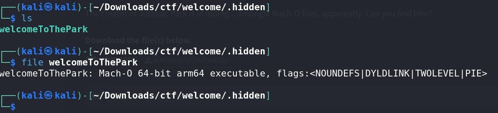
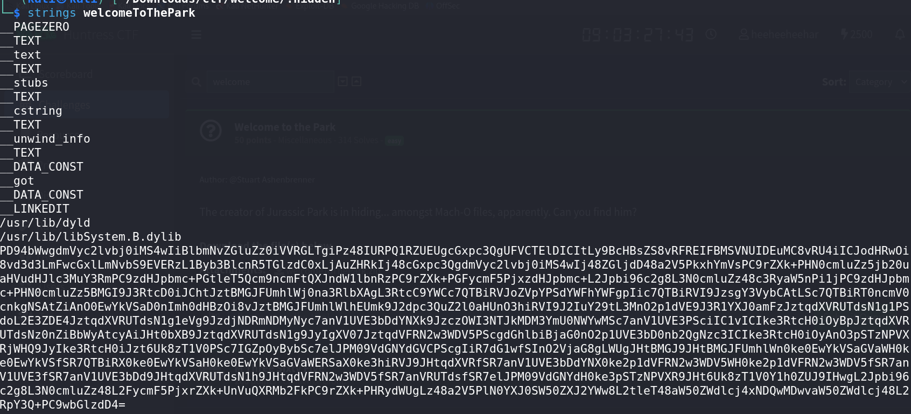
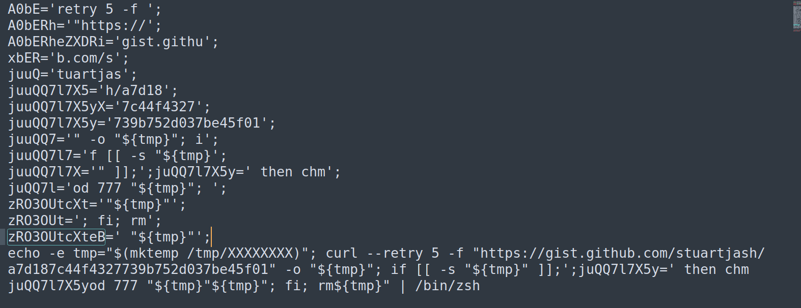
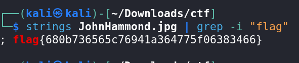

# Welcome To The Park - CTF Challenge Writeup

## Challenge Information
- **Name**: Welcome To The Park
- **Points**: 50
- **Category**: Miscellaneous

## Objective
The objective of this CTF challenge is to find and retrieve the flag. The challenge provides a zip file, and by following the steps below, you'll be able to unveil the hidden flag.

## Solution
1. **Unzip the File**: Start by unzipping the provided zip file. It should extract two folders.

2. **Choosing the Right Directory**: Among the two extracted folders, one of them is named "MACOS." You can safely assume that this directory is not relevant to the challenge, so focus on the other one.

3. **Locate the Hidden Directory**: Inside the chosen directory, you'll discover a hidden directory named ".hidden."

4. **Find the Executable**: Within the ".hidden" directory, there is an executable file. Your first task is to run the `strings` command on this executable to extract readable strings from it.

5. **Decode Base64 Message**: Among the strings obtained, you will find a base64 encoded message. Decode this message to reveal a heavily obfuscated XML code.

6. **Deobfuscate XML Code**: Your next step is to deobfuscate the XML code. This may require manual analysis, code cleanup, or the use of online tools to make the XML code readable.

7. **Discover the GitHub Link**: Within the deobfuscated XML code, you will find a GitHub link hidden or embedded. Extract this link.

8. **GitHub Repository Exploration**: Follow the GitHub link to a repository where you'll find an image named "JohnHammond.jpg." Download this image.

9.  **Steganography Techniques**: The final part of the challenge involves steganography. Employ standard steganography techniques to analyze the image "JohnHammond.jpg." This may include inspecting hidden data in the image, such as text or another file.

Once you successfully complete these steps, you should be able to uncover the flag.

## Flag
The flag is in the format `flag{XXXXXXXXXX}`. It is the final key you obtain from solving this CTF challenge. 
