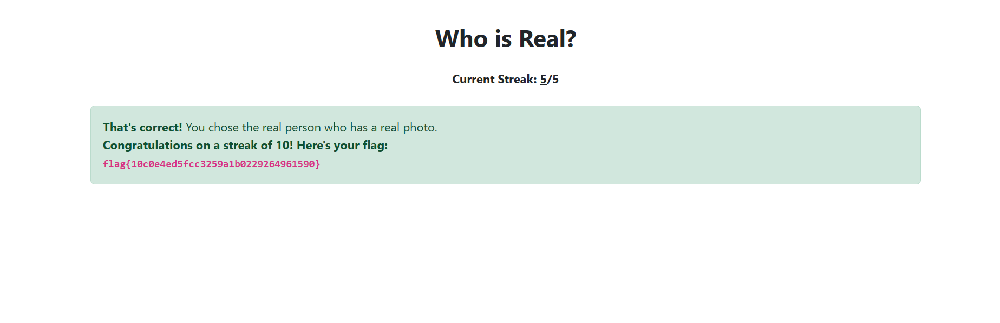

# Who Is Real - Miscellaneous Challenge

## Challenge Overview
**Name:** Who Is Real  
**Category:** Miscellaneous  
**Points:** 50

## Objective

The objective of the "Who Is Real" challenge is to distinguish between pictures of people that are generated by AI and those that are not. To solve the challenge, you need to examine a set of images, one by one, and identify specific characteristics that can help you determine whether an image is AI-generated or not.

## Solution Steps

To solve this challenge, follow these steps:

1. **Examine the Images:**
   - Start by carefully analyzing each image provided in the challenge.
   - Pay close attention to various aspects of the images to identify potential clues that distinguish AI-generated images from real ones.

2. **Identify Distorted Backgrounds:**
   - One way to distinguish AI-generated images is to look for distorted or unusual backgrounds.
   - AI-generated images may exhibit background distortions or inconsistencies that are less common in photographs of real people.
   - If you notice any image with a background that looks unnatural or out of place, it's likely generated by an AI.

3. **Note Facial Features:**
   - Observe the facial features of the people in the images.
   - AI-generated images might produce individuals with facial features that appear overly idealized, beautiful, or flawless.
   - Remember that this assessment is not a form of discrimination but an identification technique.

4. **Determine AI-Generated Images:**
   - Go through each image and make a note of which ones you believe are generated by AI based on the characteristics mentioned.
   - Keep in mind that the challenge focuses on recognizing AI-generated images rather than making value judgments about the appearance of individuals.

**Challenge Solved**

Flag: flag{XXXXXXXXXX}

This writeup provides a solution for the "Who Is Real" challenge. By identifying unusual backgrounds and overly idealized facial features in the images, you can determine which pictures are generated by AI. The key is to carefully observe each image for these characteristics without making any value judgments about the individuals depicted.
