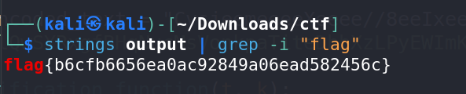

# Babel - Miscellaneous Challenge

## Challenge Overview
**Name:** Babel  
**Category:** Miscellaneous  
**Points:** 50

## Objective

The objective of the "Babel" challenge is to unravel and reverse an obfuscated C++ program, extract a base64-encoded text, decode it, and uncover the hidden flag.

## Solution Steps

To solve this challenge, follow these steps:

1. **Analyze the Given Code:**
   - Begin by examining the provided obfuscated C++ code.
   - The logic used is quite similar to the "PHP stager" challenge from the Malware category, which you might have encountered before.
   - Your goal is to understand and reverse the modifications made in this code.

2. **Deobfuscation:**
   - Deobfuscate the code to reveal the underlying logic.
   - In essence, you need to reverse the modifications made to the code.


3. **Decoding the Large Encoded Text:**
   - After successfully deobfuscating the code, you'll find a large encoded text that needs to be reversed.
   - The reversal is performed using a function with a provided key.
      ```python
      import base64

      large_encoded_text = "view solve.py for the large encoded text"
      key = "lQwSYRxgfBHqNucMsVonkpaTiteDhbXzLPyEWImKAdjZFCOvJGrU"

      def modification_function(t, k):
          character_set = "abcdefghijklmnopqrstuvwxyzABCDEFGHIJKLMNOPQRSTUVWXYZ"
          result = ""
          OrnBLfjI = {}

          for i in range(len(character_set)):
              OrnBLfjI[k[i]] = character_set[i]

          for char in t:
              if ('A' <= char <= 'Z') or ('a' <= char <= 'z'):
                  result += OrnBLfjI.get(char, char)
              else:
                  result += char

          return result

      result = modification_function(large_encoded_text, key)

      with open("output", "wb") as file:
        file.write(base64.b64decode(result))
      ```

4. **Base64 Decoding:**
   - Once you've reversed the encoded text, you'll notice that it's encoded in base64.
   - Decode this base64-encoded text to retrieve the content.

5. **Retrieve and Inspect the File:**
   - The decoded content appears to be a file.
   - Write this content into a file.
   - When you inspect the file, you'll discover that it is a "p32+" file.


1. **Flag Extraction:**
   - Without the need for extensive reverse engineering, utilize the "strings" command on the file to search for the flag.
   - The flag should be revealed within the file.


**Challenge Solved**

Flag: flag{XXXXXXXXXX}
