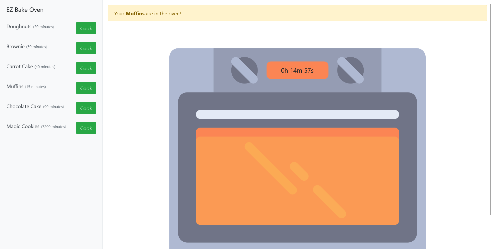
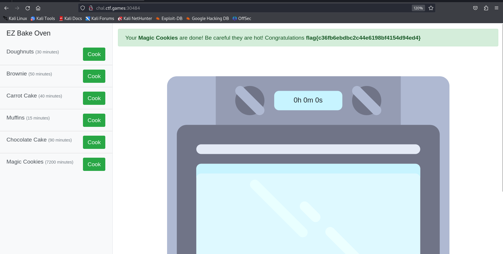

# Baking - CTF Challenge Writeup

Challenge: Baking
Points: 50
Category: Warmups

## Objective
The objective of the "Baking" challenge is to find and retrieve the flag, which is hidden within a web-based timer mechanism.

## Solution
To solve the "Baking" challenge, I followed these steps:

1. **Website Examination**:
   - Upon visiting the website provided for the challenge, I noticed a series of buttons.

2. **Starting the Timer**:
   - Clicking on any of the buttons resulted in a timer starting. The timer was counting down.

3. **Identifying Timer Manipulation**:
   - My initial assumption was that there must be a variable or mechanism controlling the timer, which, if manipulated, would reveal the flag.

4. **JavaScript Inspection**:
   - To identify and potentially modify the timer mechanism, I inspected the website's JavaScript code. However, I couldn't find any relevant timer-related code.

5. **Cookie Discovery**:
   - My next step was to examine the cookies associated with the website. I noticed a base64-encoded cookie.

6. **Decoding the Cookie**:
   - I decoded the base64-encoded cookie, revealing a JSON object within. This JSON object seemed to store information related to the timer.

7. **Modifying the JSON Object**:
   - I decided to modify the JSON object in an attempt to manipulate the timer.
   - By modifying the values related to the timer in the JSON object, I aimed to either expedite the timer countdown or complete the challenge by bypassing the timer mechanism.

8. **Timer Manipulation**:
   - I experimented with different values within the JSON object, trying to decrease the timer.
   - It's worth noting that reducing the timer from the current year (2023) to the previous year (2022) successfully manipulated the timer, completing the challenge and revealing the flag.

By following these steps, I was able to manipulate the timer mechanism in the "Baking" challenge and bypass the timer countdown to retrieve the flag.

## Flag
The flag for this challenge is in the format: `flag{XXXXXXXXXX}`.

In the "Baking" challenge, I successfully manipulated the timer mechanism to reveal the flag. The flag was hidden within a web-based timer, and modifying the timer allowed me to complete the challenge.
