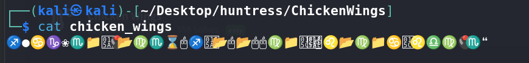
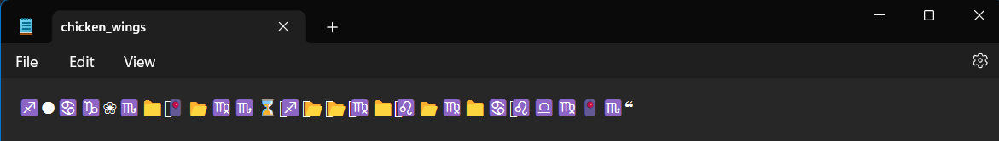

# Chicken Wings - CTF Challenge Writeup

Challenge: Chicken Wings
Points: 50
Category: Warmups

## Objective
The objective of the "Chicken Wings" challenge is to decrypt a message that initially appears to be composed of unprintable characters. By recognizing the message as a Wingdings font-encoded text, participants can reveal the flag.

## Solution
To solve the "Chicken Wings" challenge, I followed these steps:

1. **Analyzing the File**:
   - I began by examining the downloaded file provided in the challenge. When I opened the file on my Kali Linux machine, I observed that it contained a sequence of characters that appeared to be unprintable.

2. **Recognizing the Unprintable Characters**:
   - Initially, I suspected that this could be an ASCII or Unicode encoding puzzle. However, my attempts to decode the message using standard text encodings did not yield any meaningful results.

3. **Alternative Approach in Windows**:
   - To explore further, I decided to open the same file on a Windows system. There, I noticed that the characters in the file resembled a Wingdings font-encoded message.

4. **Decrypting Using Wingdings**:
   - With the realization that the message was encoded in the Wingdings font, I used the Wingdings font to decode the message.
   - [Wing Ding Decoder](https://www.dcode.fr/wingdings-font)

By recognizing the encoding method as Wingdings and decoding the message appropriately, I successfully retrieved the flag.

## Flag
The flag for this challenge is in the format: `flag{XXXXXXXXXX}`.

In the "Chicken Wings" challenge, I decrypted a message encoded in the Wingdings font. By opening the file on a Windows system and decoding the characters, I revealed the flag hidden within the Wingdings-encoded message.
