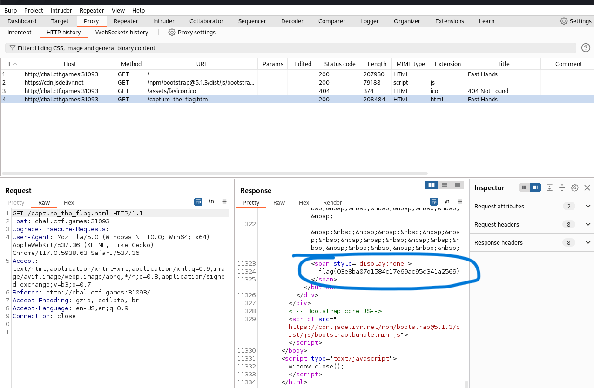

# F12 - CTF Challenge Writeup

Challenge: F12
Points: 50
Category: Warmups

## Objective
The objective of the "F12" challenge is to retrieve the flag, which is hidden within a pop-up window generated when clicking on the provided button on the web page.

## Solution
To solve the "F12" challenge, I followed these steps:

1. **Clicking the Button**:
   - Upon visiting the web page for the challenge, I noticed that there was only one button available.

2. **Pop-up Window Observation**:
   - When I clicked on the button, a window popped up briefly and closed very quickly. The flag was located within this pop-up window.

3. **Using Burp Suite**:
   - To capture the flag from the pop-up window, I decided to use Burp Suite, a popular web application security testing tool.

4. **Setting Up Burp Suite**:
   - Within Burp Suite, I utilized its proxy functionality. This allows me to intercept and observe the HTTP traffic between my browser and the web server.

5. **Browsing via Burp Suite**:
   - With the proxy function enabled in Burp Suite, I opened the challenge's web page in Burp Suite's browser. This setup allowed Burp Suite to capture and log the web traffic.

6. **Viewing HTTP History**:
   - I then examined the HTTP history within Burp Suite. In particular, I focused on the last HTTP request and response as it was associated with the pop-up window.

7. **Flag Extraction**:
   - By inspecting the last HTTP request or response in the Burp Suite history, I was able to locate and extract the flag.

By following these steps, I successfully captured the flag from the pop-up window generated when clicking the button in the "F12" challenge. Burp Suite was an essential tool for intercepting and analyzing the HTTP traffic.

## Flag
The flag for this challenge is in the format: `flag{XXXXXXXXXX}`.

In the "F12" challenge, I used Burp Suite to capture and extract the flag from the pop-up window generated when clicking the button on the web page. The flag was hidden within the web traffic captured by Burp Suite.
